#### SVD补充

课本中$11$页的SVD和平常见到的不大一样，这里做下注解，常见的SVD形式如下
$$
A=U \left[
 \begin{matrix}
\sigma_1 &&  &  \\
   & \ddots &&  \\
   &&\sigma_r&  \\
      &&&0
  \end{matrix}
  \right] V^T=U\sum V^T\\
  A\in \mathbb R^{N\times d} , U\in \mathbb R^{N\times N} ,\sum \in \mathbb R^{N\times d},
  V\in \mathbb R^{d\times d}
$$
注意$d\ge r$，我们补充$u_{r+1},...,u_d=0$，那么
$$
U\sum=
(\sigma_1 u_1,...,\sigma_d u_d, \underbrace {0,...,0}_{n-d个0向量})=
(u_1,...,u_d)\left[
 \begin{matrix}
\sigma_1   \\
   & \ddots   \\
   &&\sigma_d  \\
  \end{matrix}
  \right]=U_1 {\sum}_1\\
  U_1 \in \mathbb R^{N\times d} ,{\sum}_{1} \in R^{d\times d},U_1 ^T U_1 = I_d
$$
于是
$$
A=U_1 {\sum}_1 V^T 
$$
为课本第10页的形式


#### Exercise 9.1 (Page 1)

The Bank of Learning (BoL) gave Mr. Good and Mr. Bad credit cards based on their (Age, Income) input vector.

|                                          | Mr. Good | Mr. Bad |
| ---------------------------------------- | -------- | ------- |
| (Age in years, Income in thousands of $) | (47,35)  | (22,40) |

Mr. Good paid off his credit card bill, but Mr. Bad defaulted. Mr. Unknown who has ‘coordinates’ (21yrs,$36K) applies for credit. Should the BoL give him credit, according to the nearest neighbor algorithm? If income is measured in dollars instead of in “K” (thousands of dollars), what is your answer? 

分别计算距离
$$
d_1 = \sqrt{(47 -21)^2 + (36-35)^2} = \sqrt{677} \\
d_2 = \sqrt{(22 -21)^2 + (40-35)^2} =\sqrt{26}\\
d_1 > d_2
$$
根据KNN算法可得，应该不批准。

如果收入的单位换为K，那么
$$
d_1 = \sqrt{(47 -21)^2 + (36-35)^2 \times 1000^2} = \sqrt{1000676} \\
d_2 = \sqrt{(22 -21)^2 + (40-35)^2 \times 1000^2} =\sqrt{25000001} \\
d_2 > d_1
$$
根据KNN算法可得，应该批准。

这个例子告诉我们，使用KNN之前应该把数据归一化，这也是本章介绍的内容。


#### Exercise 9.2 (Page 3)

Define the matrix $γ = \mathbb I - \frac 1 N 11^T$. Show that $Z = γX$. ($γ$ is called the centering operator (see Appendix B.3) which projects onto the space orthogonal to $1$.)
$$
Z = X − 1\overline x^T, \overline x =\frac 1 N X^T 1\\
Z = (\mathbb I - \frac 1 N 1 1^T) X = \gamma X
$$


#### Exercise 9.3 (Page 3)

Consider the data matrix $X$ and the transformed data matrix $Z$. Show that $Z = XD$ and $Z^TZ = DX^TXD$.  
根据课本我们有
$$
z_n = D x_n,D=\text{diag}\{\frac 1 {\sigma_1},..., \frac 1 {\sigma_d}\}
$$

所以
$$
z_n^T = x_n ^TD^T =x_n^T D
$$
注意
$$
Z =  \left[
 \begin{matrix}
z_1^T \\
  ... \\
z_n^T \\
  \end{matrix}
  \right] ,
  X= \left[
 \begin{matrix}
x_1^T \\
  ... \\
x_n^T \\
  \end{matrix}
  \right]
$$
所以
$$
Z=\left[
 \begin{matrix}
x_1^TD \\
  ... \\
x_n^TD \\
  \end{matrix}
  \right] =XD
$$
因此
$$
Z^TZ=D^TX^T XD = DX^T XD
$$


#### Exercise 9.4 (Page 4)

Let $\hat x_1$ and $\hat x_2$ be independent with zero mean and unit variance. You measure inputs $x_1 = \hat x_1$ and $x_2 =\sqrt{1- \epsilon^2 }\hat x_1 + \epsilon \hat x_2$.
(a) What are variance($x_1$), variance($x_2$) and covariance($x_1, x_2$)?
(b) Suppose $f(\hat x) = \hat w_1 \hat x_1 + \hat w_2 \hat x_2$ (linear in the independent variables).Show that $f$ is linear in the correlated inputs, $f(x) = w_1x_1 + w_2x_2$.(Obtain $w_1, w_2$ as functions of $\hat w_1, \hat w_2$.)
(c) Consider the ‘simple’ target function $f(\hat x) = \hat x_1 + \hat x_2$. If you perform regression with the correlated inputs $x$ and regularization constraint $w_1^2 +w_2^2 ≤ C$, what is the maximum amount of regularization you can use (minimum value of $C$) and still be able to implement the target?
(d) What happens to the minimum $C$ as the correlation increases ($\epsilon → 0$).
(e) Assuming that there is significant noise in the data, discuss your results in the context of bias and var. 

(a)
$$
\text{Var}(x_1) = 1,\mathbb E (x_1) = 0\\
\text{Var}(x_2) = \text{Var}(\sqrt{1- \epsilon^2 }\hat x_1 + \epsilon \hat x_2)
= 1- \epsilon^2 + \epsilon^2 = 1
,\mathbb E (x_2) = 0 \\
\begin{aligned}
\text{Cov}(x_1,x_2) 
&= \mathbb E(x_1x_2) - \mathbb E (x_1)\mathbb E (x_2) \\
&=\mathbb E[(\sqrt{1- \epsilon^2 }\hat x_1 + \epsilon \hat x_2)\hat x_1] 
-\mathbb E(\sqrt{1- \epsilon^2 }\hat x_1 + \epsilon \hat x_2) \mathbb E(x_1)\\
&= \sqrt {1- \epsilon^2} \mathbb E(\hat x_1^2)+ \epsilon \mathbb E (\hat x_1 \hat x_2)\\
&=\sqrt {1- \epsilon^2}
\end{aligned}
$$
(b)解出$x_1, x_2$
$$
\hat x_1 =  x_1 \\
\hat x_2 = \frac{x_2 -\sqrt{1- \epsilon^2 }\hat x_1}{\epsilon} =\frac{x_2 -\sqrt{1- \epsilon^2 } x_1}{\epsilon}
$$
带入得
$$
\begin{aligned}
f(\hat x)& = \hat w_1 \hat x_1 + \hat w_2 \hat x_2 \\
&=  \hat w_1 x_1 + \hat w_2 \frac{x_2 -\sqrt{1- \epsilon^2 } x_1}{\epsilon} \\
&= (\hat w_1 -\frac{\sqrt{1- \epsilon^2 }}{\epsilon}\hat w_2 )x_1 +
\frac{\hat w_2}{\epsilon} x_2
\end{aligned}
$$
因此
$$
w_1 = \hat w_1 -\frac{\sqrt{1- \epsilon^2 }}{\epsilon}\hat w_2 \\
w_2 = \frac{\hat w_2}{\epsilon}
$$
(c)将$\hat w_1 = 1,\hat w_2=1$带入上式可得

$$
w_1= 1 - \frac{\sqrt{1- \epsilon^2 }}{\epsilon} \\
w_2 = \frac{1}{\epsilon}
$$
因此
$$
\begin{aligned}
w_1^2 + w_2 ^2 
&= ( 1 - \frac{\sqrt{1- \epsilon^2 }}{\epsilon} )^2 + \frac{1}{\epsilon^2} \\
&=1 +  \frac{{1- \epsilon^2 }}{\epsilon^2} -\frac{2\sqrt{1- \epsilon^2 }}{\epsilon} +\frac{1}{\epsilon^2} \\
&=\frac{2}{\epsilon^2} -\frac{2\sqrt{1- \epsilon^2 }}{\epsilon}
\end{aligned}
$$
令$\epsilon = \cos {\theta},\theta \in [0, \frac \pi 2]$，带入可得
$$
\begin{aligned}
w_1^2 + w_2 ^2 
&= 2\sec^2 \theta  - 2 \tan \theta \\
&= 2(1 +\tan^2 \theta)  -2 \tan \theta\\
&=2(\tan \theta -\frac 1 2 )^2  +\frac 3 2\\
&\ge  \frac 3 2
\end{aligned}
$$
所以$C$的最小值为$\frac 3 2$

(d)当$\epsilon \to 0$时，因为$\epsilon = \cos {\theta}$，所以$\theta \to \frac \pi 2 $，从而$\tan \theta \to \infty $，因此
$$
w_1^2 + w_2 ^2 =2(\tan \theta -\frac 1 2 )^2  +\frac 3 2 \to \infty
$$
这说明当$\epsilon \to 0$时，$C$的最小值会趋于无穷，从而正则化没有效果

(e)如果数据中有噪音，那么偏差方差都会变大。


#### Exercise 9.5 (Page 6)
Consider a data set with two examples,
$$
(x^T_1 = [-1, a_1, . . . , a_d], y_1 = +1); (x^T_2 = [1, b_1, . . . , b_d], y_2 = -1),
$$
where $a_i, b_i$ are independent random $±1$ variables. Let $x^T_{\text{test}} =[-1, -1, . . . , -1]$. Assume that only the first component of $x$ is relevant to $f$. However, the actual measured $x$ has additional random components in the additional $d$ dimensions. If the nearest neighbor rule is used, show, either mathematically or with an experiment, that the probability of classifying $x_{\text{test}}$ correctly is $\frac 1 2 +O( \frac{1}{\sqrt d} )$ ($d$ is the number of irrelevant dimensions).
What happens if there is a third data point ($x^T_3 = [1, c_1, . . . , c_d], y_3 = -1$)?

由nearest neighbor方法可知，分类正确当且仅当
$$
d(x_1, x_{\text {test}}) < d(x_2,  x_{\text {test}}) \\
\sum_{i=1}^d(a_i +1)^2 < 4+  \sum_{i=1}^d(b_i +1)^2
$$
因为$a_i, b_i \in \{1,-1\}$，所以$(a_i+1)^2, (b_i+1)^2 \in \{0,4\}$，所以上式成立当且仅当$b_i$中取$1$的个数大于等于$a_i$中取$1$的个数，因为取$1,-1$的概率相同，所以该事件发生的概率为：
$$
\sum_{j=0}^d\sum_{i=0}^j C_{d}^i \frac 1 {2^d} C_d^j \frac 1 {2^d} 
= \frac{1}{4^d}\sum_{j=0}^d\sum_{i=0}^j C_{d}^i  C_d^j
$$
考虑如下$(d+1)\times (d+1)$矩阵，第$i,j$个元素为$C_{d}^{i-1}  C_d^{j-1}$
$$
\left[
 \begin{matrix}
   C_{d}^0  C_d^0 &  C_{d}^0  C_d^1 & ...& C_{d}^0  C_d^d \\
   ... & ... & ...& ... \\
      C_{d}^d  C_d^0 &  C_{d}^d  C_d^1 & ...& C_{d}^d  C_d^d
  \end{matrix}
  \right]
$$
注意该矩阵所有元素的和为
$$
\sum_{i=1}^{d+1}\sum_{j=1}^{d+1}C_{d}^{i-1}  C_d^{j-1} 
= \sum_{i=1}^{d+1}C_{d}^{i-1}  2^d = 2^{2d}
$$
我们要计算的是对角线及其上方元素的和，由对称性可知，除去对角线下方以及对角线上方的元素和相等，而对角线上元素和为
$$
\sum_{i=1}^{d+1}C_{d}^{i-1}  C_d^{i-1}  
= \sum_{i=1}^{d+1}C_{d}^{i-1}  C_d^{d-i+1} 
=C_{2d}^d
$$
该公式只要下式两边$x^d$系数即可
$$
(1+x)^d (1+x)^d  = (1+x)^{2d}
$$
从而对角线上方元素的和为
$$
\frac{2^{2d} - C_{2d}^d}{2}
$$
从而$\sum_{j=0}^d\sum_{i=0}^j C_{d}^i  C_d^j$为
$$
\sum_{j=0}^d\sum_{i=0}^j C_{d}^i  C_d^j 
=\frac{2^{2d} - C_{2d}^d}{2} +   C_{2d}^d = \frac {4^d} 2 +\frac{C_{2d}^d}{2}
$$
概率为
$$
P= \frac 1 {4^d}(\frac {4^d} 2 +\frac{C_{2d}^d}{2}) =\frac 1 2 + \frac{{C_{2d}^d}}{2\times4^d }
$$
由斯特林公式$n!\approx \sqrt{2\pi n}(\frac{n}{e})^n$
$$
{C_{2d}^d} =\frac{(2d)!}{d! d!} \approx\frac{\sqrt{2\pi \times2d} \times(\frac{2d}{e})^{2d}}
{2\pi d \times(\frac{d}{e})^{2d}}= \frac{4^d  }{\sqrt{\pi d}}
$$

从而
$$
P\approx  \frac{1} 2  + \frac{1}{2\sqrt{\pi d}} = \frac 1 2 +O( \frac{1}{\sqrt d} )
$$
如果还有$x_3$，则分类正确当且仅当
$$
\sum_{i=1} ^d (a_i+1)^2 < 4 +\sum_{i=1} ^d (b_i+1)^2 \\
\sum_{i=1} ^d (a_i+1)^2 < 4 +\sum_{i=1} ^d (c_i+1)^2
$$
所以概率为
$$
P= (\frac 1 2 + \frac{{C_{2d}^d}}{2\times4^d })^2 =\frac 1 4 +O( \frac{1}{\sqrt d} )
$$


#### Exercise 9.6 (Page 8)

Try to build some intuition for what the rotation is doing by using the illustrations in Figure 9.1 to qualitatively answer these questions.
(a) If there is a large offset (or bias) in both measured variables, how will this affect the ‘natural axes’, the ones to which the data will be rotated? Should you perform input centering before doing PCA?


(b) If one dimension (say $x_1$) is inflated disproportionately (e.g., income is measured in dollars instead of thousands of dollars). How will this affect the ‘natural axes’, the ones to which the data should be rotated?Should you perform input normalization before doing PCA?
(c) If you do input whitening, what will the ‘natural axes’ for the inputs be? Should you perform input whitening before doing PCA? 

(a)PCA相当于旋转坐标轴，如果有较大的偏差，中心就不在原点，则旋转坐标轴之后无法使得数据落在坐标轴上，没有达到PCA的目的

(b)如果数据不成比例的膨胀，例如$x_1$非常大，那么$x_1$就会占主导成分，PCA无法萃取有效的信息，所以PCA之前要进行input whitening

(c)如果做了input whitening，自然坐标轴依旧不变，具体可以参考图片9.1，我认为绝大多数情形下在SVD之前使用PCA是有必要的


#### Exercise 9.7 (Page 10)
(a) Show that $z$ is a linear transformation of $x$, $z = V^Tx$. What are the dimensions of the matrix $V$ and what are its columns?
(b) Show that the transformed data matrix is $Z = XV$.
(c) Show that $\sum_{ i=1}^d z_i^2 = \sum_{ i=1}^d x_i^2$  and hence that $||z|| ≤ ||x||$.

(a)
$$
z_i = x^T v_i = v_i^T x,V=[v_1...v_k], v_i,x \in \mathbb R^d\\
z =  V^T x,V\in \mathbb R ^{d\times k}
$$
注意$v_i $是正交向量，所以
$$
\text{rank} (V) =  k
$$
(b)
$$
Z =  \left[
 \begin{matrix}
z_1^T \\
  ... \\
z_n^T \\
  \end{matrix}
  \right] ,
  X= \left[
 \begin{matrix}
x_1^T \\
  ... \\
x_n^T \\
  \end{matrix}
  \right]
$$
注意
$$
z_i = V^T x_i, z_i^T =x_i^T V
$$
则
$$
Z =  \left[
 \begin{matrix}
z_1^T \\
  ... \\
z_n^T \\
  \end{matrix}
  \right] =
  \left[
 \begin{matrix}
x_1^TV \\
  ... \\
x_n^TV \\
  \end{matrix}
  \right] =
    \left[
 \begin{matrix}
x_1^T \\
  ... \\
x_n^T \\
  \end{matrix}
  \right]V= XV
$$
(c)注意$z_i= x^Tv_i$

$$
\sum_{ i=1}^d z_i^2 = \sum_{ i=1}^d  z_iz_i^T =x^T \sum_{ i=1}^d (v_i v_i^T) x\\
\sum_{ i=1}^d x_i^2 = ||x||^2= x^T x\\
$$
因为$v_i$为正交向量，所以
$$
(v_1,...,v_d) (v_1,...,v_d) ^T = I_{d}
$$
从而
$$
\sum_{ i=1}^d z_i^2 =x^T x =\sum_{ i=1}^d x_i^2
$$
因为$k\le d$，所以
$$
||z||^2 =\sum_{ i=1}^k z_i^2 \le \sum_{ i=1}^d z_i^2 =x^T x=||x||^2 \\
||z||\le ||x||
$$


#### Exercise 9.8 (Page 11)

Show $U^TX = ΓV^T$ and $XV = UΓ$, and hence $X^Tu_i = γ_iv_i$ and $Xv_i = γ_iu_i$.
(The $i$th singular vectors and singular value $(u_i, v_i, γ_i)$ play a similar role to eigenvector-eigenvalue pairs.) 

因为$X= U\Gamma V^T$，$U,V$都为正交矩阵，左乘$U^T$，右乘$V$可得
$$
U^T X= \Gamma V^T\\
XV = U\Gamma
$$
比较第二个式子左右两边第$i$列可得
$$
Xv_i=  \gamma_i u_i
$$
对第一个式子取转置可得
$$
X^T U = V \Gamma^T
$$
比较这个式子左右两边第$i$列可得
$$
X^T u_i =  \gamma_i  v_i
$$


#### Exercise 9.9 (Page 12)

Consider an arbitrary matrix $A$, and any matrices $U$,$V$ with orthonormal columns ($U^TU = I$ and $V^TV = I$).
(a) Show that $||A||^2_F = \text{trace}(AA^T) = \text{trace}(A^TA)$.
(b) Show that $||UAV^T||^2_F = ||A||^2_F$ (assume all matrix products exist).
[Hint: Use part (a).]

(a)由定义可知
$$
||A||^2_F = \sum_{i=1}^n \sum_{j=1}^n  a_{ij}^2
$$
 由trace的性质可知$ \text{trace}(AA^T) = \text{trace}(A^TA)$，所以只计算第一项，$AA^T$第$(i,i)$个元素为：
$$
\sum_{j=1}^n a_{ij}^2
$$
所以
$$
\text{trace}(AA^T) = \sum_{i=1}^n \sum_{j=1}^n  a_{ij}^2=||A||^2_F
$$


(b)由(a)可知
$$
||UAV^T||^2_F =  \text{trace}(UAV^TVA^T U^T) = \text{trace}(UAA^T U^T)
$$
接着利用trace的性质$\text{trace}(AB) = \text{trace}(BA)$可得
$$
||UAV^T||^2_F  = \text{trace}(UAA^T U^T) = \text{trace}(U^TUAA^T ) = \text{trace}(AA^T)
$$


#### Exercise 9.10 (Page 16)

以下均假设$X$的奇异值分解为$X= U\Gamma V^T$

(a)注意$Z=XV$，那么
$$
Z^T Z = V^TX^TXV =   V^TV\Gamma^T U^TU\Gamma V^T V=\Gamma^T \Gamma =\Gamma^2
$$
所以$Z$的方差为
$$
\frac 1 N Z^T Z = \frac 1 N \Gamma^2
$$
根据奇异值分解的定义可知，$Z$的分量的最大方差为$\Gamma_{11}^2$，对应的分量为
$$
z_1 = X v_1
$$
从而结论成立

(b)继续(a)的讨论可知，如果选取$v_1,...,v_k$，那么我们实际上选择的是方差最大的$k$个方向

(c)我们来计算方差$\sum$
$$
\sum = \frac 1 N X^T X = \frac 1 N V \Gamma^T U^T  U\Gamma V^T=\frac 1 N V \Gamma^T\Gamma V^T
$$
做PCA实际上关注的是$V$，如果我们只知道$\sum$，那么从上式可知对$\sum$做奇异值分解即可，可以获得$X$对应的$V$


#### Exercise 9.11 (Page 18)

$$
z =  \left[
 \begin{matrix}
   1 \\
   1 \\
  2 
  \end{matrix}
  \right], 
  \hat z = z^T V_1 V_1 = 2 V_1 = 
  \left[
 \begin{matrix}
   0 \\
   0 \\
  2
  \end{matrix}
  \right]
$$

由于变换不可逆，所以不存在$\hat x $


#### Exercise 9.12 (Page 20)

(a)$\mathcal H$为一维感知机，由第二章可知其VC dimensions为$2$，$\mathcal H_+$表示分界线的斜率大于$0$的感知机，作图不难看出其VC dimensions为$1$，同理可知$\mathcal H_-$的VC dimensions为$1$

(b)由题目背景不难知道收入$x$越大，信用卡越有可能被批准，所以$h(x)$应该和$x$成正关系，所以选择$\mathcal H_+$


#### Exercise 9.13 (Page 21)

这种混合过程的使用的假设实际上是$\mathcal H$，所以VC dimensions为$2$，不能使用$\mathcal H_-$的VC dimensions


#### Exercise 9.14 (Page 22)

设
$$
f(x) = w_0+w_1x_1 + w_2x_2 +w_3 x_1^2+w_4x_2^2+w_5x_1x_2
$$
(a)对$f(x)$求偏导
$$
\frac{\partial f}{\partial x_1} =w_1 + 2w_3x_1 +w_5x_2\\
\frac{\partial f}{\partial x_2} =w_2 + 2w_4x_2 +w_5x_1
$$
$h(x)$关于$x$单调递增等价于$f(x)$关于$x$单调递增，所以$\frac{\partial f}{\partial x_1}\ge 0,\frac{\partial f}{\partial x_2}\ge0$恒成立，因此
$$
w_1\ge 0, w_2 \ge 0, w_3=w_4 =w_5= 0
$$
(b)题目的意思是关于原点旋转不变性，由于$f(x)$表示二次曲线，二次曲线中具有关于原点旋转不变性的只有圆心在原点的圆，所以限制条件为
$$
w_3= w_4,w_1=w_2=w_5=0
$$
(c)这部分详细的证明比较复杂，可以参考如下论文[二次曲线正负区域的一些性质](https://www.ixueshu.com/document/bd0692a3023e6bde318947a18e7f9386.html)，论文已下载在文件夹内，这里只给出结果，限制条件为
$$
w_3= w_4 =w_5 =0
$$


#### Exercise 9.15 (Page 24)

用数据计算hint error的目的类似于用$E_{in}$估计$E_{out}$，如果我们更关注hint error时，我们需要更多的数据


#### Exercise 9.16 (Page 24)

rotational invariance：

选择$x_n'$使得$||x_n '|| =||x_n||$，计算如下损失函数
$$
E_{\text{hint}} = \frac 1 N \sum_{n=1}^N (h(x_n) - h(x_n'))^2
$$
convexity ：

对于$x_n$，选择$x_{n1} = x_n -\Delta x_n,x_{n2} = x_n +\Delta x_n$，计算如下损失函数
$$
E_{\text{hint}} = \frac 1 N \sum_{n=1}^N (h(x_n) - \frac{h(x_{n1})+h(x_{n2})}{2})^2
[[h(x_n) >\frac{h(x_{n1})+h(x_{n2})}{2}]]
$$
perturbation：

选择一个阈值$\epsilon >0$，$x_n' = x_n + \Delta x_n$，计算如下损失函数
$$
E_{\text{hint}} = \frac 1 N \sum_{n=1}^N (h(x_n) - h(x_n'))^2
[[|h(x_n) - h(x_n')| > \epsilon]]
$$


#### Exercise 9.17 (Page 31)

由定义，不难看出损失函数为
$$
\text{error}(x_n, y_n) =  \frac{1- r_n h(x_n)}{2}
$$
从而
$$
E_{in}'(g_r ) =\min_{\mathcal H} \Big\{ \frac 1 N \sum_{n=1}^N \frac{1- r_n h(x_n)}{2} \Big\}
= \frac 1 2- \max_{\mathcal H} \Big\{ \frac 1 {2N} \sum_{n=1}^N r_n h(x_n) \Big\} \\
\frac 1 2 - E_{in}'(g_r ) = \max_{\mathcal H} \Big\{ \frac 1 {2N} \sum_{n=1}^N r_n h(x_n) \Big\}
$$


#### Exercise 9.18 (Page 35)

(a)(b)这两问尝试做了实验，但是效果不太好这里暂时不帖出来。

(c)如果数据量够大，那么交叉验证集来估计$E_{out}$效果也不错

(d)这题暂时略过


#### Problem 9.1 (Page 38)

```python
import numpy as np
import matplotlib.pyplot as plt
from matplotlib.colors import ListedColormap
from sklearn import neighbors, decomposition
from sklearn.preprocessing import StandardScaler

def knn(X, y, k):
    # Create color maps
    cmap_light = ListedColormap(['#FFAAAA', '#AAFFAA'])
    cmap_bold = ListedColormap(['#FF0000', '#00FF00'])
    
    h = .02  # step size in the mesh
    
    # we create an instance of Neighbours Classifier and fit the data.
    clf = neighbors.KNeighborsClassifier(k, weights='uniform')
    clf.fit(X, y)

    # Plot the decision boundary. For that, we will assign a color to each
    # point in the mesh [x_min, x_max]x[y_min, y_max].
    x_min, x_max = X[:, 0].min() - 1, X[:, 0].max() + 1
    y_min, y_max = X[:, 1].min() - 1, X[:, 1].max() + 1
    xx, yy = np.meshgrid(np.arange(x_min, x_max, h),
                         np.arange(y_min, y_max, h))
    #将meshgrid转换为[x,y]的坐标
    Z = clf.predict(np.c_[xx.ravel(), yy.ravel()])

    # Put the result into a color plot
    Z = Z.reshape(xx.shape)
    plt.figure()
    plt.pcolormesh(xx, yy, Z, cmap=cmap_light)

    # Plot also the training points
    plt.scatter(X[:, 0], X[:, 1], c=y, cmap=cmap_bold,
                edgecolor='k', s=20)
    plt.xlim(xx.min(), xx.max())
    plt.ylim(yy.min(), yy.max())
    plt.title("2-Class classification (k = %i)"
              % (k))
    
    plt.show()

def knn_with_pca(X, y, k):
    # Create color maps
    cmap_light = ListedColormap(['#FFAAAA', '#AAFFAA'])
    cmap_bold = ListedColormap(['#FF0000', '#00FF00'])
    
    h = .02  # step size in the mesh
    
    pca = decomposition.PCA(n_components=1)
    pca.fit(X)
    X_pca = pca.transform(X)
    
    # we create an instance of Neighbours Classifier and fit the data.
    clf = neighbors.KNeighborsClassifier(k, weights='uniform')
    clf.fit(X_pca, y)

    # Plot the decision boundary. For that, we will assign a color to each
    # point in the mesh [x_min, x_max]x[y_min, y_max].
    x_min, x_max = X[:, 0].min() - 2, X[:, 0].max() + 2
    y_min, y_max = X[:, 1].min() - 2, X[:, 1].max() + 2
    xx, yy = np.meshgrid(np.arange(x_min, x_max, h),
                         np.arange(y_min, y_max, h))
    
    newdata = pca.transform(np.c_[xx.ravel(), yy.ravel()])
    Z = clf.predict(newdata)

    # Put the result into a color plot
    Z = Z.reshape(xx.shape)
    plt.figure()
    plt.pcolormesh(xx, yy, Z, cmap=cmap_light)

    # Plot also the training points
    plt.scatter(X[:, 0], X[:, 1], c=y, cmap=cmap_bold,
                edgecolor='k', s=20)
    #plt.xlim(xx.min() , xx.max() )
    #plt.ylim(yy.min() , yy.max() )
    plt.title("2-Class classification with pca (k = %i)"
              % (k))
    
    plt.show()

#(a)
X = np.array([[0, 0], [0, 1], [5, 5]])
y = np.array([1, 1, -1])
knn(X, y, 1)
knn(X, y, 2)

#(b)
scaler = StandardScaler()
X1 = scaler.fit_transform(X)
y = np.array([1, 1, -1])
knn(X1, y, 1)
knn(X1, y, 2)

#(c)
knn_with_pca(X, y, 1)
knn_with_pca(X, y, 2)
```


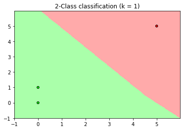

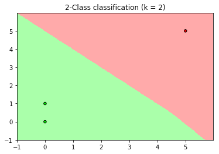

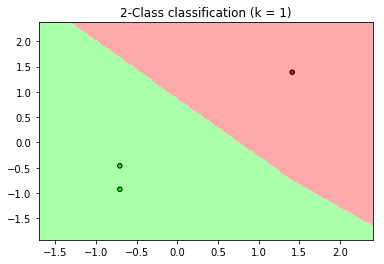

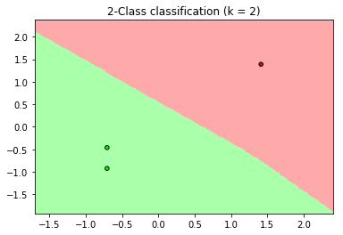

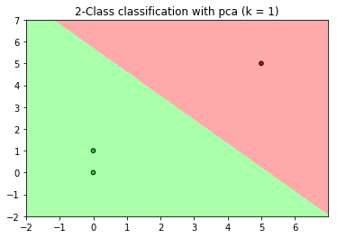

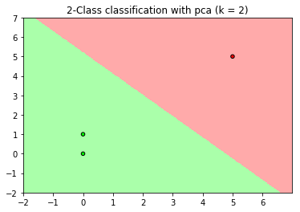


#### Problem 9.2 (Page 38)

(a)center：

首先计算均值：
$$
\overline x' = \overline x + b
$$
所以
$$
z_n'  = x_n'- \overline x '= x_n + b - \overline x - b =x_n -  \overline x = z_n
$$
这说明平移不会影响center

normalization：
$$
{\sigma_i'^2} = \frac 1 N \sum_{n=1}^N x_{ni}'^2 = \frac 1 N \sum_{n=1}^N (x_{ni}+b)^2
\neq \sigma_i^2
$$
考察分量
$$
z_{ni}' =  \frac{x_{ni}'}{{\sigma_i'} } =\frac{x_{ni}+b}{{\sigma_i'} }  \neq z_{ni}
$$
这说明平移会影响normalization

whitening：
$$
\begin{aligned}
{\sum}' 
&= \frac 1 N \sum_{n=1}^N (x_n'- \overline x')(x_n- \overline x')^T\\
&=\frac 1 N \sum_{n=1}^N (x_n+b- \overline x-b)(x_n+b- \overline x-b)^T\\
&=\frac 1 N \sum_{n=1}^N (x_n- \overline x)(x_n- \overline x)^T\\
&=\sum
\end{aligned}
$$
所以
$$
z_n' = {\sum'}^{-\frac 1 2 } x_n' ={\sum}^{-\frac 1 2 } (x_n+b) = z_n +{\sum}^{-\frac 1 2 } b
$$
这说明平移会影响whitening

(b)center：

首先计算均值：
$$
\overline x' =\alpha \overline x
$$
所以
$$
z_n'  = x_n'- \overline x '= \alpha x_n - \alpha \overline x  
=\alpha(x_n - \overline x)=\alpha z_n
$$
这说明伸缩会影响center

normalization：
$$
{\sigma_i'^2} = \frac 1 N \sum_{n=1}^N x_{ni}'^2 = \frac 1 N \sum_{n=1}^N (\alpha x_{ni})^2
= \frac {\alpha^2} N \sum_{n=1}^N  x_{ni}^2 =\alpha^2\sigma_i^2
$$
考察分量
$$
z_{ni}' =  \frac{x_{ni}'}{{\sigma_i'} } =\frac{\alpha x_{ni}}{\alpha \sigma_i } = z_{ni}
$$
这说明伸缩不会影响normalization

whitening：
$$
\begin{aligned}
{\sum}' 
&= \frac 1 N \sum_{n=1}^N (x_n'- \overline x')(x_n- \overline x')^T\\
&=\frac 1 N \sum_{n=1}^N (\alpha x_n - \alpha \overline x  )(\alpha x_n - \alpha \overline x  )^T\\
&=\frac {\alpha^2} N \sum_{n=1}^N (x_n- \overline x)(x_n- \overline x)^T\\
&=\alpha^2\sum
\end{aligned}
$$
所以
$$
z_n' = {\sum'}^{-\frac 1 2 } x_n' ={\sum}^{-\frac 1 2 }{\alpha}^{-1} \alpha x_n
={\sum}^{-\frac 1 2 } x_n =z_n
$$
这说明伸缩不会影响whitening

(b)假设
$$
A=\text{diag}\{a_1,...,a_d\}
$$
那么
$$
x_n' = \left(
 \begin{matrix}
  a_1 x_{n1}\\
  ... \\
  a_d x_{nd}
  \end{matrix}
  \right)
$$
center：

首先计算均值：
$$
\overline x' =A \overline x
$$
所以
$$
z_n'  = Ax_n -A \overline x
=A(x_n -\overline x)  =A z_n
$$
这说明伸缩会改变center

normalization：
$$
{\sigma_i'^2} = \frac 1 N \sum_{n=1}^N x_{ni}'^2 
= \frac 1 N \sum_{n=1}^N a_i^2 x_{ni}^2= \frac {a_i^2} N \sum_{n=1}^N  x_{ni}^2 
=a_i^2 \sigma_i^2
$$
所以
$$
z_{ni}' =  \frac{x_{ni}'}{{\sigma_i'} } =\frac{a_ix_{ni}}{a_i\sigma_i } 
= \frac{x_{ni}}{\sigma_i } =z_{ni}
$$
这说明伸缩不会改变normalization

whitening：
$$
\begin{aligned}
{\sum}' 
&= \frac 1 N \sum_{n=1}^N (x_n'- \overline x')(x_n- \overline x')^T\\
&=\frac 1 N \sum_{n=1}^N (A x_n - A \overline x)(A x_n - A \overline x)^T\\
&=\frac {\alpha^2} N \sum_{n=1}^N A(x_n- \overline x)(x_n- \overline x)^TA^T\\
&= A\sum A^T\\
\end{aligned}
$$
所以
$$
z_n ={\sum}'^{-\frac 1 2 } x_n' ={\sum}'^{-\frac 1 2 } Ax_n
$$
没法继续化简，所以这说明伸缩会改变whitening

(d)center：

首先计算均值：
$$
\overline x' =A \overline x
$$
所以
$$
z_n'  = Ax_n -A \overline x
=A(x_n -\overline x)  =A z_n
$$
这说线性变换会改变center

normalization：

这里就不列式子表示了，但是结果是线性变换会改变normalization

whitening：
$$
\begin{aligned}
{\sum}' 
&= \frac 1 N \sum_{n=1}^N (x_n'- \overline x')(x_n- \overline x')^T\\
&=\frac 1 N \sum_{n=1}^N (A x_n - A \overline x)(A x_n - A \overline x)^T\\
&=\frac {\alpha^2} N \sum_{n=1}^N A(x_n- \overline x)(x_n- \overline x)^TA^T\\
&= A\sum A^T\\
\end{aligned}
$$
所以
$$
z_n ={\sum}'^{-\frac 1 2 } x_n' ={\sum}'^{-\frac 1 2 } Ax_n
$$
没法继续化简，所以这说明线性变换会改变whitening


#### Problem 9.3 (Page 38)

直接验证即可
$$
{\sum}^{\frac 1 2 }{\sum}^{\frac 1 2 }=U\Gamma^{\frac 1 2 } U^TU\Gamma^{\frac 1 2 } U^T
=U\Gamma^{\frac 1 2 } \Gamma^{\frac 1 2 } U^T = U \Gamma U^T = \sum \\
{\sum}^{-\frac 1 2 }{\sum}^{-\frac 1 2 }=U\Gamma^{-\frac 1 2 } U^TU\Gamma^{-\frac 1 2 } U^T
=U\Gamma^{-\frac 1 2 } \Gamma^{-\frac 1 2 } U^T 
=U\Gamma^{-1} U^T ={\sum}^{-1}
$$


#### Problem 9.4 (Page 38)

因为
$$
A=V \psi
$$
左乘$V^T$，注意$V$为正交基，因此
$$
V^T A = V^T V \psi = \psi
$$
接下来验证$\psi$为正交矩阵
$$
\psi^T \psi  =A^TV V^T A= A^T A  = I
$$
所以$\psi$为正交矩阵


#### Problem 9.5 (Page 39)

以下都对照课本第11页，假设$A \in \mathbb R^{N \times d}$

(a)此时为对角阵，所以$N=d$，比较第11页的形式不难发现
$$
U= V= I_N, A =\Gamma
$$
(b)$A$的行向量互相正交，所以
$$
AA^T = \text{diag}(\sigma_1^2,...,\sigma_N^2) =\Lambda
$$
将$A= U\Gamma V^T$带入可得，注意$\Gamma$为对角矩阵
$$
U\Gamma V^T V\Gamma^T U^T = U\Gamma^2 U^T = \Lambda
$$
那么
$$
U =\left[
 \begin{matrix}
I_d  \\

  0
  \end{matrix}
  \right]
$$
此时
$$
U\Gamma = \left[
 \begin{matrix}
\Gamma\\

  0
  \end{matrix}
  \right]
$$
所以SVD分解为
$$
A= \Gamma V^T
$$
(c)$A$的列向量互相正交，所以
$$
A^TA= \text{diag}(\sigma_1^2,...,\sigma_d^2) =\Lambda
$$
将$A= U\Gamma V^T$带入可得，注意$\Gamma$为对角矩阵
$$
V\Gamma^T U^TU\Gamma V^T =  V\Gamma^2 V^T = \Lambda
$$
不难看出$V= I_d$即可，所以SVD分解为
$$
A= U \Gamma
$$

(d)
$$
QA = Q U\Gamma V^T
$$
注意
$$
(QU)^T QU= U^T Q^T QU=U^T U= I
$$
所以SVD分解为
$$
QA = (Q U)\Gamma V^T
$$
(e)取如下分块形式
$$
U= \left[
 \begin{matrix}
U_1 &&   \\
   & \ddots   \\
   &&U_m  \\
  \end{matrix}
  \right],
 \Gamma= \left[
 \begin{matrix}
\Gamma_1 &&   \\
   & \ddots   \\
   && \Gamma_m  \\
  \end{matrix}
  \right],
   V= \left[
 \begin{matrix}
V_1 &&   \\
   & \ddots   \\
   && V_m  \\
  \end{matrix}
  \right]
$$

注意到
$$
U^TU = \left[
 \begin{matrix}
U_1^T &&   \\
   & \ddots   \\
   &&U_m^T  \\
  \end{matrix}
  \right]\left[
 \begin{matrix}
U_1 &&   \\
   & \ddots   \\
   &&U_m  \\
  \end{matrix}
  \right] = I_N,
V^TV=VV^T = \left[
 \begin{matrix}
V_1^T &&   \\
   & \ddots   \\
   &&V_m^T  \\
  \end{matrix}
  \right]\left[
 \begin{matrix}
V_1 &&   \\
   & \ddots   \\
   &&V_m  \\
  \end{matrix}
  \right]  =I_d
$$
所以SVD分解
$$
A=U\Gamma V^T
$$


#### Problem 9.6 (Page 39)


```python
import numpy as np
import matplotlib.pyplot as plt
from sklearn import decomposition

data = np.genfromtxt("zip.train")
X = data[:, 1:]
Y = data[:, 0]
pca = decomposition.PCA(n_components=2)
pca.fit(X)
X_pca = pca.transform(X)

plt.scatter(X_pca[:, 0], X_pca[:, 1], s=5, c = Y, cmap='gist_ncar')
plt.colorbar()
plt.title("digits data with 2 components PCA")
plt.show()
```

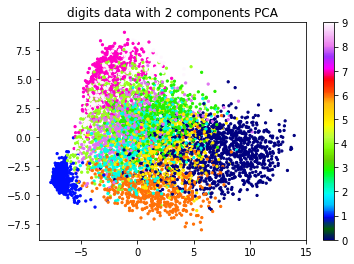

下一题告诉我们数据已经whitened


#### Problem 9.7 (Page 39)

因为
$$
z_n = \Gamma_k^{-1}V_k^T x_n
$$
所以
$$
Z=\left[
 \begin{matrix}
z_1^T   \\
...   \\
z_N^T\\
  \end{matrix}
  \right]  =
  \left[
 \begin{matrix}
x_1^TV_k  (\Gamma_k^{-1})^T   \\
...   \\
x_N^TV_k  (\Gamma_k^{-1})^T \\
  \end{matrix}
  \right]=
    \left[
 \begin{matrix}
x_1^T  \\
...   \\
x_N^T \\
  \end{matrix}
  \right] V_k (\Gamma_k^{-1})^T =XV_k (\Gamma_k^{-1})^T
$$
我们计算$Z^TZ$，注意$X=U\Gamma V^T$
$$
\begin{aligned}
Z^T Z 
&=\Gamma_k^{-1}V_k ^T X^T XV_k (\Gamma_k^{-1})^T \\
&=\Gamma_k^{-1}V_k ^T V\Gamma^T  U^T U\Gamma V^TV_k (\Gamma_k^{-1})^T \\
&=\Gamma_k^{-1}V_k ^T V\Gamma^T \Gamma V^TV_k (\Gamma_k^{-1})^T 
\end{aligned}
$$

我们考虑$V_k ^T V,V^T V_k$，注意$V$为正交矩阵
$$
V_k^T V= \left[
 \begin{matrix}
v_1^T \\
...   \\
v_k^T  \\
  \end{matrix}
  \right]  \left[
 \begin{matrix}
v_1,...,v_d
  \end{matrix}
  \right]   = \left[
 \begin{matrix}
I_k & 0
  \end{matrix}
  \right] \in \mathbb R ^{k\times d} \\
  V^T V_K =(V_k^T V)^T =\left[
 \begin{matrix}
I_k\\
0
  \end{matrix}
  \right]
$$
从而
$$
V_k ^TV\Gamma^T \Gamma V^TV_k = \left[
 \begin{matrix}
I_k & 0
  \end{matrix}
  \right] 
 \left[
 \begin{matrix}
\gamma_1 &&   \\
   & \ddots   \\
   && \gamma_d  \\
  \end{matrix}
  \right] \left[
 \begin{matrix}
\gamma_1 &&   \\
   & \ddots   \\
   && \gamma_d  \\
  \end{matrix}
  \right] \left[
 \begin{matrix}
I_k\\
0
  \end{matrix}
  \right] =
  \left[
 \begin{matrix}
\gamma_1^2 &&   \\
   & \ddots   \\
   && \gamma_k^2  \\
  \end{matrix}
  \right]
$$
因此
$$
\begin{aligned}
Z^T Z 
&=\Gamma_k^{-1}V_k ^T V\Gamma^T \Gamma V^TV_k (\Gamma_k^{-1})^T \\
&=\Gamma_k^{-1}\left[
 \begin{matrix}
\gamma_1^2 &&   \\
   & \ddots   \\
   && \gamma_k^2  \\
  \end{matrix}
  \right](\Gamma_k^{-1})^T\\
  &= I_k
\end{aligned}
$$
从而$z_n$为whitened


#### Problem 9.8 (Page 39)

(a)无法画出和教材中一样的图片，暂时没有找到问题在哪

```python
import numpy as np
import matplotlib.pyplot as plt
from sklearn import decomposition

data = np.genfromtxt("zip.train")
X = data[:, 1:]
# center
mean = np.mean(X, axis=0)
X = X - mean
Y = data[:, 0]
l = 1
X1 = X[Y == l]
X2 = X[Y != l]

pca = decomposition.PCA(n_components=1)
pca.fit(X1)
z1 = pca.transform(X)
pca.fit(X2)
z2 = pca.transform(X)

plt.scatter(z1[Y == l], z2[Y == l], s=5)
plt.scatter(z1[Y != l], z2[Y != l], s=5)
plt.title("+1 digits VS -1 digits with 2 components PCA")
plt.show()
```


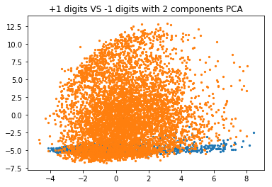

(b)由算法描述可知，$v_1,v_2$不一定正交

(c)因为$\hat V$列满秩，所以$\hat V$存在左伪逆矩阵$\hat V^† = (\hat V^ T \hat  V)^{-1}\hat  V^T=\hat V^T$，回顾课本12页的公式可知
$$
\hat X = Z \hat V \hat V^T =  Z \hat V \hat V^† 
$$
(d)这个算法利用到了标签，所以是监督式学习


#### Problem 9.9 (Page 40)

(a)因为$\hat X$是由$X$投影到$k$个基向量得到的矩阵，所以$\text{rank}(\hat X) = k$

(b)此处原题有误，根据课本12页的Exercise 9.9可知
$$
||X-\hat X ||_F^2 =||U^T(X-\hat X)V ||_F^2 =||\Gamma - U^T\hat XV ||_F^2
$$
(c)利用秩不等式
$$
\text{rank}(AB) \le \min \{\text{rank} (A), \text{rank}(B)\}
$$
所以
$$
\text{rank}(\hat\Gamma) =\text{rank}(U^T\hat XV)  \le \text{rank}(\hat X) =k
$$
(d)我们的目标是最小化$||\Gamma - U^T\hat XV ||_F^2= ||\Gamma - \Gamma' ||_F^2$，由定义可知
$$
||\Gamma - \Gamma' ||_F^2 =\sum_{i=1}^d \sum_{j=1}^d (\gamma_{ij}- \gamma_{ij}')^2
=\sum_{i=1}^d (\gamma_{ii}- \gamma_{ii}')^2 + \sum_{i\ne j}  \gamma_{ij}'^2 \ge \sum_{i=1}^d (\gamma_{ii}- \gamma_{ii}')^2
$$
上述等式利用了$\Gamma$为对角阵，不难看出上述不等式当且仅当$\gamma_{ij}'=0$时才成立，所以$\hat \Gamma$的最优选择为非对角线元素全为$0$

(e)现在已经确定$\hat \Gamma$为对角矩阵，由于$\text{rank}(\hat\Gamma)\le k $，这说明对角线的非$0$元素最多有$k$个

(f)继续利用定义，注意$\Gamma$和$\hat \Gamma$为对角矩阵
$$
||\Gamma - \Gamma' ||_F^2 =\sum_{i=1}^d (\gamma_{ii}- \gamma_{ii}')^2 
=\sum_{i=1}^k (\gamma_{ii}- \gamma_{ii}')^2 + \sum_{i=k+1}^d \gamma_{ii}^2 
\ge  \sum_{i=k+1}^d \gamma_{ii}^2
$$
上述等号成立当且仅当$\gamma_{ii}'= \gamma_{ii}$

(g)题目有误，正确的应该是
$$
\hat X = X V_k V_k^T
$$
直接带入计算可得
$$
U^T\hat XV = U^T X V_k V_k^T V =U^T U\Gamma V^T V_k V_k^T V
=\Gamma V^T V_k V_k^T V
$$
注意$V$为正交矩阵，因此
$$
V_k^T V = \left[
 \begin{matrix}
v_1^T\\
...\\ v_k^T 
  \end{matrix}
  \right] 
  \left[
 \begin{matrix}
v_1& ... & v_k & ... & v_d 
  \end{matrix}
  \right] 
  = \left[
 \begin{matrix}
I_k& 0
  \end{matrix}
  \right]
$$
从而
$$
V^T V_k V_k^T V = ( V_k^T V)^T  V_k^T V=
\left[
 \begin{matrix}
I_k\\0
  \end{matrix}
  \right]
  \left[
 \begin{matrix}
I_k&0
  \end{matrix}
  \right] = \left[
 \begin{matrix}
I_k&0 \\
0 & 0
  \end{matrix}
  \right] \\
  U^T\hat XV 
=\Gamma V^T V_k V_k^T V =\Gamma \left[
 \begin{matrix}
I_k&0 \\
0 & 0
  \end{matrix}
  \right] =  
 \left[
 \begin{matrix}
\gamma_1 &&   \\
   & \ddots   \\
   && \gamma_k  \\
      &&& 0   \\
  \end{matrix}
  \right]
$$
这说明$  U^T\hat XV$为$\hat \Gamma$的最优解


#### Problem 9.10 (Page 40)

(a)算法1是先进行SVD然后再进划分数据，算法2是先划分数据再进行SVD

(b)$E_1,E_2$均值比$E_{out}$大，这是因为PCA降维后减少了一些信息，从而误差会变大；$E_1$均值比$E_{2}$小，这是因为算法1是先进行SVD，这时候会利用到交叉验证集的数据，从而整体误差会小一些

```python
#### (b)
import numpy as np
from numpy.linalg import inv
import matplotlib.pyplot as plt
from sklearn import decomposition

#### (i)
N = 40
d = 5
k = 3

def data(N, d):
    x = np.random.randn(N, d)
    w = np.random.randn(d)
    epsilon = np.random.randn(N) * 0.5
    y = x.dot(w) + epsilon
    return w, x, y

#### (ii)
#Algorithm 1
def Algorithm_1(x, y, k):
    pca = decomposition.PCA(n_components=k)
    pca.fit(x)
    z = pca.fit_transform(x)
    e1 = []
    for i in range(N):
        index = np.array([True] * N)
        index[i] = False
        z0 = z[i]
        y0 = y[i]
        z1 = z[index]
        y1 = y[index]
        w = inv(z1.T.dot(z1)).dot(z1.T).dot(y1)
        e1.append((z0.dot(w) - y0) ** 2)
    return np.mean(e1)

#Algorithm 2
def Algorithm_2(x, y, k):  
    e2 = []
    pca = decomposition.PCA(n_components=k)
    for i in range(N):
        index = np.array([True] * N)
        index[i] = False
        x0 = x[i].reshape(1, -1)
        y0 = y[i]
        x1 = x[index]
        y1 = y[index]
        
        pca.fit(x1)
        z1 = pca.fit_transform(x1)
        w = inv(z1.T.dot(z1)).dot(z1.T).dot(y1)
        
    #    z0 = pca.fit_transform(x0)
        z0 = x0.dot(pca.components_.T)
    
        e2.append((z0.dot(w) - y0) ** 2)
    return np.mean(e2)

#### (iii)
def E_out(x, y, w):
    #计算结果
    w0 = inv(x.T.dot(x)).dot(x.T).dot(y)
    #获得新的数据来模拟Eout
    d = x.shape[1]
    N = 10000
    x1 = np.random.randn(N, d)
    epsilon = np.random.randn(N) * 0.5
    y1 = x1.dot(w) + epsilon
    y0 = x1.dot(w0)
    return np.mean((y1 - y0) ** 2)

#### (iv)
w, x, y = data(N, d)
print("E1 =", Algorithm_1(x, y, k))
print("E2 =", Algorithm_2(x, y, k))
print("E_out =", E_out(x, y, w))


#### (v)
M = 1000
E1 = []
E2 = []
Eout = []
for i in range(M):
    w, x, y = data(N, d)
    E1.append(Algorithm_1(x, y, k))
    E2.append(Algorithm_2(x, y, k))
    Eout.append(E_out(x, y, w))
    
plt.hist(E1)
plt.title("E1")
plt.show()
plt.hist(E2)
plt.title("E2")
plt.show()
plt.hist(Eout)
plt.title("Eout")
plt.show()
print("E1_mean =", np.mean(E1))
print("E2_mean =", np.mean(E2))
print("E_out_mean =", np.mean(Eout))

```

    E1 = 0.538838556358
    E2 = 0.612163338131
    E_out = 0.321355196027

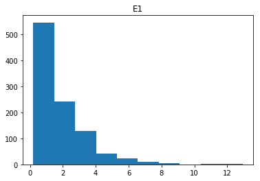


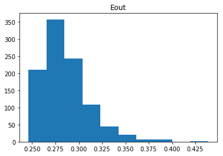


    E1_mean = 1.82117996189
    E2_mean = 2.19237149596
    E_out_mean = 0.286213319201
(c)(b)中已经解释了，算法1是先进行SVD，这时候会利用到交叉验证集的数据，这是不大准确的计算方法

(d)我认为算法2更正确一些


#### Problem 9.11 (Page 41)

(a)不难看出，如果$\lambda$不变，那么$d_{eff}$随着次数的增加而增加，所以如果$d_{eff}$不变，那么$\lambda$会减小

(b)利用Chaper 4，Problem 4.15(c)计算$d_{eff}$
$$
d_{eff}(\lambda)=\sum_{i=0}^d\frac{s_i^4}{(s_i+\lambda)^2}
$$
不难看出$d_{eff}$关于$\lambda$单调，从而可以用二分法解此方程

由于exercise 9.18有点问题，(c)(d)暂时略过


#### Problem 9.12 (Page 41)

(a)
$$
\begin{aligned}
E_{out}^{\pi} (h)
&=  \frac 1 4 \mathbb E_{x,\pi}[(h(x) - f_{\pi}(x))^2]\\
&= \frac 1 4\sum_{n=1}^N \mathbb E_{\pi}[(h(x) - f_{\pi}(x))^2|x =x _n]P(x=x_n) \\
&=\frac 1 4\sum_{n=1}^N \mathbb E_{\pi}[(h(x_n) - f_{\pi}(x_n))^2]\frac 1 N \\
&=\frac 1 {4N} \sum_{n=1}^N \mathbb E_{\pi}[(h(x_n) - f_{\pi}(x_n))^2]
\end{aligned}
$$
(b)注意$f_{\pi}(x_n) =y_{\pi_n}$
$$
\begin{aligned}
E_{out}^{\pi} (h)
&=\frac 1 {4N} \sum_{n=1}^N \mathbb E_{\pi}[(h(x_n) - f_{\pi}(x_n))^2] \\
&=\frac 1 {4N} \sum_{n=1}^N \mathbb E_{\pi}[(h(x_n) -\overline y+\overline y- y_{\pi_n})^2]\\
&=\frac 1 {4N} \sum_{n=1}^N 
\Big( \mathbb  E_{\pi}[(h(x_n) -\overline y)^2]+\mathbb E_{\pi}[(\overline y- y_{\pi_n})^2]
+2 \mathbb E_{\pi}[(h(x_n) -\overline y)(\overline y- y_{\pi_n})] \Big) \\
&=\frac 1 {4N} \sum_{n=1}^N  \mathbb  E_{\pi}[(h(x_n) -\overline y)^2]+
\frac 1 {4N} \sum_{n=1}^N  \mathbb E_{\pi}[(\overline y- y_{\pi_n})^2] +
\frac 1 {2N}\sum_{n=1}^N  \mathbb E_{\pi}[(h(x_n) -\overline y)(\overline y- y_{\pi_n})]
\end{aligned}
$$
下面分别分析每一项。

第一项：$(h(x_n) -\overline y)^2$关于排列$\pi$为常数，所以
$$
\frac 1 {4N} \sum_{n=1}^N  \mathbb  E_{\pi}[(h(x_n) -\overline y)^2]= 
\frac 1 {4N} \sum_{n=1}^N (h(x_n) -\overline y)^2
$$
第二项：
$$
\begin{aligned}
\frac 1 {4N} \sum_{n=1}^N  \mathbb E_{\pi}[(\overline y- y_{\pi_n})^2]
&=\frac 1 {4N} \sum_{n=1}^N \sum_{i=1}^N \mathbb E_{\pi}[(\overline y- y_{\pi_n})^2|\pi_n = i ]P(\pi_n = i)\\
&=\frac 1 {4N} \sum_{n=1}^N \sum_{i=1}^N \mathbb E_{\pi}[(\overline y- y_i)^2]\frac 1 N  \\
&=\frac 1 {4N} \sum_{n=1}^N \sum_{i=1}^N (\overline y- y_i)^2\frac 1 N \\
&=\frac 1 {4N} \sum_{i=1}^N (\overline y- y_i)^2\\
&=\frac{s_y^2}{4}
\end{aligned}
$$
第三项：$(h(x_n) -\overline y)$关于排列$\pi$为常数，所以
$$
\begin{aligned}
\frac 1 {2N}\sum_{n=1}^N  \mathbb E_{\pi}[(h(x_n) -\overline y)(\overline y- y_{\pi_n})]
&=\frac 1 {2N}\sum_{n=1}^N  (h(x_n) -\overline y) \mathbb E_{\pi}[(\overline y- y_{\pi_n})]\\
&=\frac 1 {2N}\sum_{n=1}^N  (h(x_n) -\overline y) 
\sum_{i=1}^N\mathbb E_{\pi}[(\overline y- y_{\pi_n})|\pi_n=i] P(\pi_n = i) \\
&=\frac 1 {2N}\sum_{n=1}^N  (h(x_n) -\overline y) 
\sum_{i=1}^N\mathbb E_{\pi}[(\overline y- y_{i})] \frac 1 N \\
&=\frac 1 {2N}\sum_{n=1}^N  (h(x_n) -\overline y) 
\sum_{i=1}^N(\overline y- y_{i}) \frac 1 N \\
&=0
\end{aligned}
$$
综上可得
$$
E_{out}^{\pi}(h)  = \frac{s_y^2}{4}+ \frac 1 {4N} \sum_{n=1}^N (h(x_n) -\overline y)^2
$$
(c)由定义可知
$$
E_{in}^{\pi} (h) = \frac 1 {4N} \sum_{n=1}^N (h(x_n) -y_{\pi_n})^2
$$
为了计算(d)，对上式进行处理，注意$f_{\pi}(x_n) =y_{\pi_n}$
$$
\begin{aligned}
E_{in}^{\pi} (h) 
&= \frac 1 {4N} \sum_{n=1}^N (h(x_n) -y_{\pi_n})^2 \\
&= \frac 1 {4N} \sum_{n=1}^N (h(x_n) -\overline y + \overline y -y_{\pi_n})^2 \\
&= \frac 1 {4N} \sum_{n=1}^N \Big[(h(x_n) -\overline y)^2 + (\overline y -y_{\pi_n})^2  
+ 2(h(x_n) -\overline y) (\overline y -y_{\pi_n})\Big]\\
&= \frac 1 {2N} \sum_{n=1}^N  (h(x_n) -\overline y) (\overline y -y_{\pi_n})+
\frac 1 {4N} \sum_{n=1}^N (h(x_n) -\overline y)^2 +  \frac{s_y^2}{4}\\
\end{aligned}
$$
(d)不难看出相减的结果为
$$
\begin{aligned}
E_{out}^{\pi}(h)-E_{in}^{\pi} (h) 
&= -\frac 1 {2N} \sum_{n=1}^N  (h(x_n) -\overline y) (\overline y -y_{\pi_n})\\
&=-\frac 1 {2N}\sum_{n=1}^N  h(x_n)(\overline y -y_{\pi_n})
+\frac 1 {2N} \overline y\sum_{n=1}^N  (\overline y -y_{\pi_n}) \\
&=\frac 1 {2N}\sum_{n=1}^N  (y_{\pi_n} -\overline y)h(x_n)
\end{aligned}
$$
(e)不难看出，上式即为协方差，所以结论成立


#### Problem 9.13 (Page 42)

Bootstrap为重复抽样，只要重新计算第一步即可，实际上，由重复抽样的定义可知$P(x=x_n)=\frac 1 N $，所以上述推导不变，所以结论都一样。


#### Problem 9.14 (Page 42)

```python
import numpy as np
import matplotlib.pyplot as plt

#(a)
def f(N):
    #生成数据
#    N = 40
    X = np.random.randn(N)
    r = np.sign(np.random.rand(N) - 0.5)
    
    #寻找阈值
    X1 = np.sort(X)
    X2 = (X1[1:] + X1[:-1]) / 2
    X2 = np.append(X1[0] - 1, X2)
    X2 = np.append(X2, X1[-1] + 1)
    
    #计算结果
    temp = np.sign(X1.reshape(-1, 1) - X2)
    result = np.mean(temp != r.reshape(-1, 1), axis=0)
    error = np.min(result)
    
    return 1 / 2 - error

N = np.arange(1, 101)
Error = []
for n in N:
    Error.append(f(n))
plt.plot(N, Error)
plt.title("penalty VS N")
plt.show()

#(b)
m = 100
Error = []
for n in N:
    error = []
    for _ in range(m):
        error.append(f(n))
    Error.append(np.mean(error))
plt.plot(N, Error)
plt.title("mean penalty VS N")
plt.show()

#(c)
N1 = 1 / np.sqrt(N)
plt.plot(N, Error)
plt.plot(N, N1, label="$1/\sqrt{N}$")
plt.title("mean penalty VS N")
plt.legend()
plt.show()
```


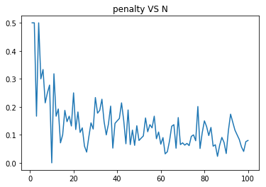

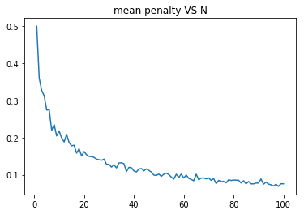


(c)可以看到Rademacher penalty的数量级为$O(\frac 1 {\sqrt N})$，VC-penalty略过 


#### Problem 9.15 (Page 43)

由第二章可知
$$
P(|E'_{out}(g_r) -E'_{in}(g_r)| > \epsilon ) \le 2 m_{\mathcal H }(N)e^{-2N\epsilon^2}\\
P(|E'_{out}(g_r) -E'_{in}(g_r)| \le \epsilon )\ge 1- 2 m_{\mathcal H }(N)e^{-2N\epsilon^2}
$$
令$\delta =2 m_{\mathcal H }(N)e^{-2N\epsilon^2} $，可得
$$
e^{2N\epsilon^2} =  \frac{2 m_{\mathcal H }(N)}{\delta}\\
2N\epsilon^2 = \ln (\frac{2 m_{\mathcal H }(N)}{\delta}) \\
\epsilon = \sqrt{ \frac {1}{2N} \ln (\frac{2 m_{\mathcal H }(N)}{\delta})}
$$
所以上式可以理解为至少有$1-\delta$概率
$$
|E'_{out}(g_r) -E'_{in}(g_r)| \le \sqrt{ \frac {1}{2N} \ln (\frac{2 m_{\mathcal H }(N)}{\delta})} 
$$
即至少有$1-\delta$概率
$$
\text{Rademacher optimism penalty} \le  \delta
$$


#### Problem 9.16 (Page 43)

(a)

(i)
$$
E_{out}(g) = E_{in}(g)+E_{out}(g) - E_{in}(g) 
\le E_{in}(g)  + \max_{h\in \mathcal H}(E_{out}(h) - E_{in}(h) )
$$
(ii)不难发现，误差函数为
$$
\text{err}(x,y) = \frac{1- xy}{2}
$$
所以
$$
E_{out}(h) =\frac 1 2 (1- \mathbb E_{x}[f(x)h(x)])\\
E_{in}(h) =\frac 1 {2N} \sum_{n=1}^N(1- y_n h(x_n))\\
\max_{h\in \mathcal H}(E_{out}(h) - E_{in}(h) )=
\frac 1 {2}\max_{h\in \mathcal H} 
\Big\{ 
\frac 1 N \sum_{n=1}^N y_n h(x_n)  - \mathbb E_{x}[f(x)h(x)]
\Big\}
$$
(iii)首先估计改变$x_i$，$\frac 1 {2N} \sum_{n=1}^N y_n h(x_n)  - \mathbb E_{x}[f(x)h(x)]$的变化，注意第二项不变，第一项最多变化$\frac 1 N $，取最大值后最多变化$\frac 1 N $，从而引理中的$c_i = \frac 1 N$，注意引理中的$n= N$，因此
$$
\sqrt{\frac 1 2 \sum_{i=1}^N c_i ^2  \ln \frac 2 \delta} 
=\sqrt{\frac 1 {2N}  \ln \frac 2 \delta}
$$
从而有大于等于$1-\delta$的概率
$$
\frac 1 {2}\max_{h\in \mathcal H} 
\Big\{ 
\frac 1 N \sum_{n=1}^N y_n h(x_n)  - \mathbb E_{x}[f(x)h(x)]
\Big\} 
\le \frac 1 {2}\mathbb E_{\mathcal D}\Big[\max_{h\in \mathcal H} 
\Big\{ 
\frac 1 N \sum_{n=1}^N y_n h(x_n)  - \mathbb E_{x}[f(x)h(x)]
\Big\}
\Big] +\sqrt{\frac 1 {2N}  \ln \frac 2 \delta}
$$
(iv)
$$
\begin{aligned}
  \mathbb E_{x}[f(x)h(x)]
  &=\sum_{n=1}^N \mathbb E_{x,\mathcal D'}[f(x)h(x)|x = x_n']P(x=x_n')\\
  &=\frac 1 N \sum_{n=1}^N \mathbb E_{x,\mathcal D'}[f(x_n')h(x_n')]\\
  &=\frac 1 N \sum_{n=1}^N \mathbb E_{\mathcal D'}[y_n'h(x_n')]
\end{aligned}
$$
因此
$$
\begin{aligned}
\max_{h\in \mathcal H} 
\Big\{ 
\frac 1 N \sum_{n=1}^N y_n h(x_n)  - \mathbb E_{x}[f(x)h(x)]
\Big\}
&=\max_{h\in \mathcal H} 
\Big\{ 
\frac 1 N \sum_{n=1}^N (y_n h(x_n)  -\mathbb E_{\mathcal D'}[y_n'h(x_n')])
\Big\}\\
&=\max_{h\in \mathcal H} 
\Big\{ 
\frac 1 N \mathbb E_{\mathcal D'}\Big[\sum_{n=1}^N (y_n h(x_n)  -y_n'h(x_n'))\Big]
\Big\}\\
&\le \mathbb E_{\mathcal D'}
\Big[
\max_{h\in \mathcal H}  \frac 1 N \sum_{n=1}^N (y_n h(x_n)  -y_n'h(x_n'))
\Big]
\end{aligned}
$$
从而有$1-\delta$的概率
$$
\mathbb  E_{out}(g) 
\le\mathbb  E_{in}(g)  + \frac 12  \mathbb E_{\mathcal D,\mathcal D'}
\Big[
\max_{h\in \mathcal H}  \frac 1 N \sum_{n=1}^N (y_n h(x_n)  -y_n'h(x_n'))
\Big]
+ \sqrt{\frac 1 {2N}  \ln \frac 2 \delta}
$$
(v)注意如果$h\in \mathcal H$，那么$-h\in \mathcal H$，从而对任意$r_n \in \{+1, -1\}$，$r_n h\in \mathcal H$，所以
$$
\max_{h\in \mathcal H}  \frac 1 N \sum_{n=1}^N r_n(y_n h(x_n)  -y_n'h(x_n'))
\le \max_{h\in \mathcal H}  \frac 1 N \sum_{n=1}^N r_n y_n h(x_n) +
\max_{h\in \mathcal H}  \frac 1 N \sum_{n=1}^N r_n y_n' h(x_n')
=2 \max_{h\in \mathcal H}  \frac 1 N \sum_{n=1}^N r_n y_n h(x_n)
$$
因此
$$
\begin{aligned}
\mathbb E_{\mathcal D,\mathcal D'}
\Big[
\max_{h\in \mathcal H}  \frac 1 N \sum_{n=1}^N (y_n h(x_n)  -y_n'h(x_n'))
\Big]
&=\mathbb E_{\mathcal D,\mathcal D'}
\Big[
\max_{h\in \mathcal H}  \frac 1 N \sum_{n=1}^N r_n(y_n h(x_n)  -y_n'h(x_n'))
\Big] \\

&\le 2\mathbb E_{\mathcal D,\mathcal D'}
\Big[
\max_{h\in \mathcal H}  \frac 1 N \sum_{n=1}^N r_n y_n h(x_n)
\Big]\\
&= 2\mathbb E_{\mathcal D}
\Big[
\max_{h\in \mathcal H}  \frac 1 N \sum_{n=1}^N r_n y_n h(x_n)
\Big]
\end{aligned}
$$
最后一步是因为期望内部和$\mathcal D'$无关，因此至少有$1-\delta$的概率
$$
\mathbb  E_{out}(g) 
\le\mathbb  E_{in}(g)  + \mathbb E_{\mathcal D}
\Big[
\max_{h\in \mathcal H}  \frac 1 N \sum_{n=1}^N r_n y_n h(x_n)
\Big]
+ \sqrt{\frac 1 {2N}  \ln \frac 2 \delta}
$$
(vi)如果$P(r_n=1)=\frac 1 2$
$$
\begin{aligned}
P(r_ny_n=1) 
&= P(r_ny_n=1|r_n =1) P(r_n =1)+P(r_ny_n=1|r_n =-1) P(r_n =-1)\\
&= \frac1 2 P(y_n=1)+\frac 1 2
P(y_n=-1)\\
&=\frac 1 2 
\end{aligned}
$$
从而$r_ny_n$与$r_n$分布相同，所以
$$
\mathbb E_{\mathcal D}
\Big[
\max_{h\in \mathcal H}  \frac 1 N \sum_{n=1}^N r_n y_n h(x_n)
\Big] = \mathbb E_{r,\mathcal D}
\Big[
\max_{h\in \mathcal H}  \frac 1 N \sum_{n=1}^N r_n h(x_n)
\Big]
$$
因此至少有$1-\delta$的概率
$$
\mathbb  E_{out}(g) 
\le\mathbb  E_{in}(g)  + \mathbb E_{r,\mathcal D}
\Big[
\max_{h\in \mathcal H}  \frac 1 N \sum_{n=1}^N r_n h(x_n)
\Big]
+ \sqrt{\frac 1 {2N}  \ln \frac 2 \delta}
$$
(b)

(i)改变某个$x_n$，$\frac 1 N \sum_{n=1}^N r_n h(x_n)$最多改变$\frac 2 N$，从而$\max_{h\in \mathcal H}  \frac 1 N \sum_{n=1}^N r_n h(x_n)$最多改变$\frac 2 N$

(ii)由上题可知，引理中$c_i=\frac 2 N,n= N$，因此至少有$1-\delta$的概率
$$
\mathbb E_{r,\mathcal D}
\Big[
\max_{h\in \mathcal H}  \frac 1 N \sum_{n=1}^N r_n h(x_n)
\Big]
\le \max_{h\in \mathcal H}  \frac 1 N \sum_{n=1}^N r_n h(x_n) +\sqrt{\frac 2 {N}  \ln \frac 2 \delta}
$$
(iii)$A\le B$，$B\le C$可以推出$A\le C$，所以
$$
P(A\le B，B\le C) \le P(A\le C)
$$
注意到
$$
\begin{aligned}
P(A\le B，B\le C) 
&= P(A\le B)+P(B\le C) -P(A\le B\bigcup B\le C)\\
&\ge P(A\le B)+P(B\le C) - 1
\end{aligned}
$$
所以如果$P(A\le B) \ge 1-\delta_1,P(B\le C) \ge 1-\delta_1$，
$$
P(A\le C) \ge  2-2\delta_1  - 1 = 1-2\delta_1
$$
取$\delta = 2\delta_1$可得
$$
P(A\le C) \ge  1 -\delta
$$
注意我们已有的结论为，至少有$\ge 1-\delta/ 2$的概率
$$
\mathbb  E_{out}(g) 
\le\mathbb  E_{in}(g)  + \mathbb E_{r,\mathcal D}
\Big[
\max_{h\in \mathcal H}  \frac 1 N \sum_{n=1}^N r_n h(x_n)
\Big]
+ \sqrt{\frac 1 {2N}  \ln \frac 2 {\delta/ 2}}\\
$$
至少有$\ge 1-\delta/ 2$的概率
$$
\mathbb E_{r,\mathcal D}
\Big[
\max_{h\in \mathcal H}  \frac 1 N \sum_{n=1}^N r_n h(x_n)
\Big]
\le \max_{h\in \mathcal H}  \frac 1 N \sum_{n=1}^N r_n h(x_n) +\sqrt{\frac 2 {N}  \ln \frac 2 {\delta /2}}
$$

所以这里
$$
A=\mathbb  E_{out}(g) \\
B= \mathbb  E_{in}(g)  + \mathbb E_{r,\mathcal D}
\Big[
\max_{h\in \mathcal H}  \frac 1 N \sum_{n=1}^N r_n h(x_n)
\Big]
+ \sqrt{\frac 1 {2N}  \ln \frac 2 {\delta/ 2}} \\
C= \mathbb  E_{in}(g)  +  \max_{h\in \mathcal H}  \frac 1 N \sum_{n=1}^N r_n h(x_n) +\sqrt{\frac 2 {N}  \ln \frac 2 {\delta /2}}
+ \sqrt{\frac 1 {2N}  \ln \frac 2 {\delta / 2}}
$$
注意到
$$
\sqrt{\frac 2 {N}  \ln \frac 2 {\delta /2}}
+ \sqrt{\frac 1 {2N}  \ln \frac 4 {\delta /2}}=
 \sqrt{\frac 1 {2N}  \ln \frac 4 {\delta}}(2+ 1)
 =\sqrt{\frac 9 {2N}  \ln \frac 4 {\delta}}
$$

所以至少有$1-\delta$的概率
$$
\mathbb  E_{out}(g) \le
\mathbb  E_{in}(g)  +  \max_{h\in \mathcal H}  \frac 1 N \sum_{n=1}^N r_n h(x_n) 
+\sqrt{\frac 9 {2N}  \ln \frac 4 {\delta}}
$$


#### Problem 9.17 (Page 43)

暂时略过，思路基本同上一题，参考论文在文件夹内。


#### Problem 9.18 (Page 45)

(a)注意
$$
g_{(\pi)} (x_n) = (Hy')_n = \sum_{m=1}^N H_{nm} y_{\pi_m}
$$
所以
$$
\begin{aligned}
\frac 2 N \sum_{n=1}^N (y_{\pi_n } -\overline y)g_{(\pi)} (x_n)
&=\frac 2 N \sum_{n=1}^N (y_{\pi_n } -\overline y) \sum_{m=1}^N H_{nm} y_{\pi_m}\\
&=\frac 2 N \sum_{m,n=1}^NH_{nm}  (y_{\pi_n } -\overline y)  y_{\pi_m}\\
&=\frac 2 N \sum_{m,n=1}^NH_{nm}( y_{\pi_m}y_{\pi_n }- \overline y y_{\pi_m})
\end{aligned}
$$
(b)
$$
\begin{aligned}
\mathbb E_{\pi} [y_{\pi_n }] =
&\sum_{i=1}^N \mathbb E_{\pi} [y_{\pi_n }|\pi_n =i] P(\pi_n = i)\\
&=\frac 1 N \sum_{i=1}^N y_i\\
&= \overline y
\end{aligned}
$$
如果$m=n$，那么
$$
\begin{aligned}
\mathbb E_{\pi} [y_{\pi_m }y_{\pi_n}] 
&=\mathbb E_{\pi} [y_{\pi_n }^2] \\
&=\sum_{i=1}^N \mathbb E_{\pi} [y_{\pi_n }^2|\pi_n =i] P(\pi_n = i)\\
&=\frac 1 N \sum_{i=1}^N y_{i}^2 \\
&=\overline y ^2 + s_y^2
\end{aligned}
$$
如果$m\ne n$，那么
$$
\begin{aligned}
\mathbb E_{\pi} [y_{\pi_m }y_{\pi_n}] 
&=\sum_{i\neq j} \mathbb E_{\pi} [y_{\pi_m }y_{\pi_n}|\pi_n =i,\pi_m =j] 
P(\pi_n =i,\pi_m =j)\\
&=\frac 1 {N(N-1)} \sum_{i\neq j}  y_i y_j \\
&=\frac 1 {N(N-1)} \Big(\sum_{i=1}^N\sum_{j=1}^N y_i y_j -\sum_{i=1}^N y_i^2   \Big)\\
&=\frac 1 {N(N-1)} \Big(N^2 \overline y^2 - \sum_{i=1}^N y_i^2 \Big) \\
&=\frac 1 {N(N-1)} \Big(N^2 \overline y^2 -N \overline y^2 +N \overline y^2- \sum_{i=1}^N y_i^2 \Big) \\
&= \overline y^2 -\frac 1 {N-1}s_y^2
\end{aligned}
$$
(c)我们来计算(a)式的期望，注意$\hat \sigma_y^2 =\frac N {N-1}s_y^2$
$$
\begin{aligned}
\mathbb E [\frac 2 N \sum_{m,n=1}^NH_{nm}( y_{\pi_m}y_{\pi_n }- \overline y y_{\pi_m})]
&=\frac 2 N \mathbb E [\sum_{m,n=1}^NH_{nm} y_{\pi_m}y_{\pi_n }]
-\frac 2 N \mathbb E [\sum_{m,n=1}^NH_{nm}\overline y y_{\pi_m}] \\
&=\frac 2 N \mathbb E [\sum_{m\neq n }H_{nm} y_{\pi_m}y_{\pi_n }]
+\frac 2 N \mathbb E [\sum_{m=n }H_{nm} y_{\pi_m}y_{\pi_n }]
-\frac 2 N {\sum_{m,n=1}^N} H_{nm}\overline y^2\\
&=\frac 2 N  {\sum_{m\neq n }}H_{nm} (\overline y ^2 -\frac 1 {N-1} s_y^2)
+\frac 2 N \sum_{n=1 }^NH_{nn} (\overline y ^2 + s_y^2) -\frac 2 N  {\sum_{m,n=1}^N} H_{nm}\overline y^2\\
&=-\frac 2 N  {\sum_{m\neq n }}H_{nm}  \frac 1 {N-1} s_y^2+
\frac 2 N \sum_{n=1 }^NH_{nn} s_y^2\\
&=-\frac 2 N  {\sum_{m, n=1 }^N}H_{nm}  \frac 1 {N-1} s_y^2
+\frac 2 N \sum_{n=1 }^NH_{nn} s_y^2+
\frac 2 N  {\sum_{n=1 }^N} H_{nn}  \frac 1 {N-1} s_y^2\\
&=-\frac 2 {N(N-1)}  {\sum_{m, n=1 }^N}H_{nm}   s_y^2+
\frac 2 {N-1}{\sum_{n=1 }^N} H_{nn}  s_y^2 \\
&=-\frac 2 {N^2}  {\sum_{m, n=1 }^N}H_{nm}   \hat \sigma_y^2 +
\frac 2 {N}{\sum_{n=1 }^N} H_{nn}  \hat \sigma_y^2 \\
&=\frac{2\hat \sigma_y^2 }{N}\Big(
\text{trace}(H) -\frac {1^T H 1}N
\Big)
\end{aligned}
$$


#### Problem 9.19 (Page 46)

第一步不变，然后我们重新计算 $\mathbb E_{\pi} [y_{\pi_n }],E_{\pi} [y_{\pi_m }y_{\pi_n}] $
$$
\begin{aligned}
\mathbb E_{\pi} [y_{\pi_n }] =
&\sum_{i=1}^N \mathbb E_{\pi} [y_{\pi_n }|\pi_n =i] P(\pi_n = i)\\
&=\frac 1 N \sum_{i=1}^N y_i\\
&= \overline y
\end{aligned}
$$
如果$m=n$，那么
$$
\begin{aligned}
\mathbb E_{\pi} [y_{\pi_m }y_{\pi_n}] 
&=\mathbb E_{\pi} [y_{\pi_n }^2] \\
&=\sum_{i=1}^N \mathbb E_{\pi} [y_{\pi_n }^2|\pi_n =i] P(\pi_n = i)\\
&=\frac 1 N \sum_{i=1}^N y_{i}^2 \\
&=\overline y ^2 + s_y^2
\end{aligned}
$$


如果$m\neq n$，注意Bootstrap为重复抽样，那么
$$
\begin{aligned}
\mathbb E_{\pi} [y_{\pi_m }y_{\pi_n}] 
&=\sum_{i,j=1}^N  \mathbb E_{\pi} [y_{\pi_m }y_{\pi_n}|\pi_n =i,\pi_m =j] 
P(\pi_n =i,\pi_m =j)\\
&=\frac 1 {N^2}\sum_{i=1}^N\sum_{j=1}^N y_i y_j \\
&= \overline y^2
\end{aligned}
$$
所以
$$
\begin{aligned}
\mathbb E [\frac 2 N \sum_{m,n=1}^NH_{nm}( y_{\pi_m}y_{\pi_n }- \overline y y_{\pi_m})]
&=\frac 2 N \mathbb E [\sum_{m,n=1}^NH_{nm} y_{\pi_m}y_{\pi_n }]
-\frac 2 N \mathbb E [\sum_{m,n=1}^NH_{nm}\overline y y_{\pi_m}] \\
&=\frac 2 N \mathbb E [\sum_{m\neq n }H_{nm} y_{\pi_m}y_{\pi_n }]
+\frac 2 N \mathbb E [\sum_{m=n }H_{nm} y_{\pi_m}y_{\pi_n }]
-\frac 2 N {\sum_{m,n=1}^N} H_{nm}\overline y^2\\
&=\frac 2 N  {\sum_{m\neq n }}H_{nm} \overline y ^2
+\frac 2 N \sum_{n=1 }^NH_{nn} (\overline y ^2 + s_y^2) -\frac 2 N  {\sum_{m,n=1}^N} H_{nm}\overline y^2\\
&=\frac 2 N \sum_{n=1 }^NH_{nn} s_y^2\\
&=\frac{2s_y^2 }{N}
\text{trace}(H)
\end{aligned}
$$


#### Problem 9.20 (Page 46)

见Problem 8.15


#### Problem 9.21 (Page 46)

(a)回顾problem 4.26我们知道
$$
e_n =\Big(
\frac {\hat y_n-y_n}{1-H_{nn}}
\Big)^2
$$
所以
$$
E_{\text{cv}}(\mathcal D_m) =\frac 1 {N-1}
\sum_{n\neq m}\Big(
\frac {\hat y_n^{(m)}-y_n}{1-H_{nn}^{(m)}}
\Big)^2
$$
(b)记$A=Z^TZ +\lambda \Gamma^T \Gamma=\sum_{n=1}^N z_n z_n^T +\lambda \Gamma^T \Gamma$，所以
$$
A^{(m)}=\sum_{n=1}^N z_n z_n^T-z_mz_m^T +\lambda \Gamma^T \Gamma
=A -z_mz_m^T
$$
注意$H=ZA^{-1}Z^T$，$H^{(m)}=Z{A^{(m)}}^{-1}Z^T$，所以
$$
H_{nk} = z_n^T A^{-1}z_k\\
H_{nk}^{(m)} =z_n^T (A -z_mz_m^T)^{-1}z_k
$$

回顾Problem 4.26可知
$$
\begin{aligned}
H_{nk}^{(m)}
&=z_n^T (A^{-1}+\frac{A^{-1}z_mz_m^TA^{-1}}{1-z_m^TA^{-1}z_m})z_k \\
&=z_n^T A^{-1}z_k +\frac{(z_n^TA^{-1}z_m)(z_m^TA^{-1}z_k)}{1-z_m^TA^{-1}z_m} \\
&=H_{nk} + \frac{H_{nm}H_{mk}}{1-H_{mm}}
\end{aligned}
$$
(c)由Problem 4.26可知
$$
w^{(m)} 
=w + \frac{\hat y_m-y_m}{1-H_{mm}}A^{-1}z_m
$$
所以
$$
\begin{aligned}
\hat y_n^{(m)}
&=z_n^T w^{(m)} \\
&=z_n^T(w + \frac{\hat y_m-y_m}{1-H_{mm}}A^{-1}z_m) \\
&=z_n^Tw +\frac{\hat y_m-y_m}{1-H_{mm}}z_n^TA^{-1}z_m \\
&= \hat y_n  +\frac{\hat y_m-y_m}{1-H_{mm}} H_{nm}
\end{aligned}
$$
由$H$为对称矩阵可知$H_{mn}=H_{nm}$，从而
$$
\hat y_n^{(m)} =\hat y_n  +\frac{\hat y_m-y_m}{1-H_{mm}} H_{mn}
$$
(d)回顾(a)中的等式
$$
E_{\text{cv}}(\mathcal D_m) 
=\frac 1 {N-1}
\sum_{n\neq m}\Big(
\frac {\hat y_n^{(m)}-y_n}{1-H_{nn}^{(m)}}
\Big)^2
$$
首先计算分子$(\hat y_n^{(m)}-y_n)^2$
$$
\begin{aligned}
(\hat y_n^{(m)}-y_n)^2
&=(\hat y_n  +\frac{\hat y_m-y_m}{1-H_{mm}} H_{mn}- y_n)^2 \\
&=(\hat y_n- y_n  +\frac{\hat y_m-y_m}{1-H_{mm}} H_{mn})^2
\end{aligned}
$$
接着计算分母$(1-H_{nn}^{(m)})^2$，注意$H$为对称矩阵
$$
\begin{aligned}
(1-H_{nn}^{(m)})^2 
&=(1- H_{nn}-\frac{H_{nm}H_{mn}}{1-H_{mm}})^2 \\
&=(1- H_{nn}-\frac{H_{nm}^2}{1-H_{mm}})^2
\end{aligned}
$$

注意到如果$m=n$，那么分子分母分别变为
$$
\begin{aligned}
分子&=(\hat y_m- y_m  +\frac{\hat y_m-y_m}{1-H_{mm}} H_{mm})^2 \\
&=\Big(\frac{(\hat y_m- y_m)(1-H_{mm}) +(\hat y_m-y_m)H_{mm}}{1-H_{mm}} \Big)^2 \\
&=\Big(\frac{\hat y_m- y_m}{1-H_{mm}} \Big)^2
\end{aligned}
$$

$$
\begin{aligned}
分母&=(1- H_{mm}-\frac{H_{mm}^2}{1-H_{mm}})^2 \\
&=\Big(\frac{(1- H_{mm})^2 -H_{mm}^2}{1-H_{mm}} \Big)^2 \\
&=\Big(\frac{1-2H_{mm}}{1-H_{mm}} \Big)^2
\end{aligned}
$$

所以
$$
\begin{aligned}
E_{\text{cv}}(\mathcal D_m) 
&=\frac 1 {N-1}
\sum_{n\neq m}\Big(
\frac {\hat y_n^{(m)}-y_n}{1-H_{nn}^{(m)}}
\Big)^2 \\
&=\frac 1 {N-1}
\sum_{n=1}^N \Big(
\frac {\hat y_n^{(m)}-y_n}{1-H_{nn}^{(m)}}
\Big)^2 -\frac 1 {N-1}\Big(
\frac {\hat y_m^{(m)}-y_m}{1-H_{mm}^{(m)}}
\Big)^2 \\
&=\frac 1 {N-1}\sum_{n=1}^N
\Big(\frac{\hat y_n- y_n  +\frac{\hat y_m-y_m}{1-H_{mm}} H_{mn}}
{1- H_{nn}-\frac{H_{nm}^2}{1-H_{mm}}}
\Big)^2 - \frac 1 {N-1}
\Big(
\frac{\hat y_m- y_m}{1-2H_{mm}}
\Big)^2
\end{aligned}
$$
注意这里我认为是减号，不是加号

(e)回顾课本150页可知
$$
E_{\text {cv} }(\mathcal D)= \frac 1 N \sum_{n=1}^N(\frac{\hat y_n-y_n}{1-H_{nn}})^2
$$
回顾第九章29页可得
$$
\begin{aligned}
l_m 
&\approx  E_{\text {cv} }(\mathcal D) - E_{\text{cv}}(\mathcal D_m)  \\
&=  \frac 1 N \sum_{n=1}^N(\frac{\hat y_n-y_n}{1-H_{nn}})^2 -
\frac 1 {N-1}\sum_{n=1}^N
\Big(\frac{\hat y_n- y_n  +\frac{\hat y_m-y_m}{1-H_{mm}} H_{mn}}
{1- H_{nn}-\frac{H_{nm}^2}{1-H_{mm}}}
\Big)^2 + \frac 1 {N-1}
\Big(
\frac{\hat y_m- y_m}{1-2H_{mm}}
\Big)^2
\end{aligned}
$$
接下来分析计算复杂度，注意$X^TX +\lambda \Gamma^T \Gamma $为$d\times d$矩阵，所以计算$ (X^TX +\lambda \Gamma^T \Gamma )^{-1}$的时间复杂度为$O(d^3)$，注意到
$$
H = X (X^TX +\lambda \Gamma^T \Gamma )^{-1} X^T 
$$
所以计算$H$的时间复杂度为$O(N d^2 + N^2 d)$，注意到
$$
\hat y_n = x_n^Tw = x_n^TA^{-1} x^T y = H_{n:} y
$$
其中$H_{n:}$为$H$的第$n$行，所以计算$\hat y_n $的时间复杂度为$O(N)$，所以计算全部$\hat y_n $的时间为$O(N^2)$，所以计算全部$l_m$的时间复杂度为$O(N d^2 + N^2 d)$


#### Problem 9.22 (Page 47)

```python
import numpy as np
from numpy.linalg import inv
import matplotlib.pyplot as plt

X = np.array([[1, 0.51291],
     [1, 0.46048],
     [1, 0.3504],
     [1, 0.095046],
     [1, 0.43367],
     [1, 0.70924],
     [1, 0.11597]])
y = np.array([0.36542, 0.22156,
     0.15263, 0.10355,
     0.10015, 0.26713,
     2.3095])

def l(X, y, Lambda):
    #计算
    w = inv(X.T.dot(X) + Lambda).dot(X.T).dot(y)
    H = X.dot(inv(X.T.dot(X) + Lambda)).dot(X.T)
    y_hat = X.dot(w)
    
    N = X.shape[0]
    H1 = np.diag(H)
    Ecv = np.mean(((y - y_hat) / (1 - H1)) ** 2)
    
    #最后一个点
    m = N - 1
    #分子
    e1 = y_hat - y + (y_hat[m] - y[m]) / (1 - H[m][m]) * H[m, :]
    #分母
    e2 = 1 - H1 - H[m, :] ** 2 / (1 - H1)
    Ecv_m = 1 / (N - 1) * np.sum((e1 / e2) ** 2) - \
            1 / (N - 1) * ((y_hat[m] - y[m]) / (1 - 2 * H[m][m])) ** 2
    return Ecv - np.mean(Ecv_m)

Lambda = np.linspace(0, 10, num=300)
leverage = []
for i in Lambda:
    leverage.append(l(X, y, i))

plt.scatter(X[:, 1], y)
plt.show()

plt.plot(Lambda, leverage)
plt.xlabel("$\lambda$")
plt.ylabel("leverage")
plt.title("$\lambda$ VS leverage")
plt.show()
```


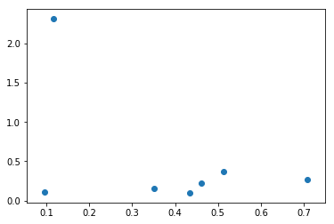

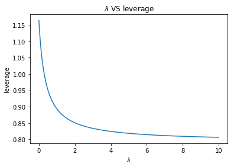

作图后可以发现，随着$\lambda$的增加，异常点（最后一个点）的影响在减少，这是因为增加$\lambda$会使得范化能力增加，$E_{\text {cv} }$减少


#### Problem 9.23 (Page 48)

```python
import numpy as np
import matplotlib.pyplot as plt
from numpy.linalg import inv

data = np.genfromtxt("features.train")
#预处理数据
N = 500
X = data[:, 1:][:N]
y = data[:, 0][:N]
y = (y == 1).astype("double")

def l(X, y, Lambda):
    #计算
    w = inv(X.T.dot(X) + Lambda).dot(X.T).dot(y)
    H = X.dot(inv(X.T.dot(X) + Lambda)).dot(X.T)
    y_hat = X.dot(w)
    
    N = X.shape[0]
    H1 = np.diag(H)
    Ecv = np.mean(((y - y_hat) / (1 - H1)) ** 2)
    Ecvm = np.array([])
    
    for m in range(N):
        #分子
        e1 = y_hat - y + (y_hat[m] - y[m]) / (1 - H[m][m]) * H[m, :]
        #分母
        e2 = 1 - H1 - H[m, :] ** 2 / (1 - H1)
        Ecv_m = 1 / (N - 1) * np.sum((e1 / e2) ** 2) - \
                1 / (N - 1) * ((y_hat[m] - y[m]) / (1 - 2 * H[m][m])) ** 2
        Ecvm = np.append(Ecvm, Ecv_m)
    return Ecv - Ecvm

Lambda = 0
#计算影响
leverage = l(X, y, Lambda)
#找到影响最大的10个点
label = leverage.argsort() > N - 9
#作图
plt.scatter(X[y==1][:, 0], X[y==1][:, 1], s=1, c="r", label="one")
plt.scatter(X[y!=1][:, 0], X[y!=1][:, 1], s=1, c="b", label="not one")
plt.scatter(X[:, 0][label], X[:, 1][label], color='', marker='o', edgecolors='g', s=50)
plt.title("leverage with $\lambda={}$".format(Lambda))
plt.legend()
plt.show()
```


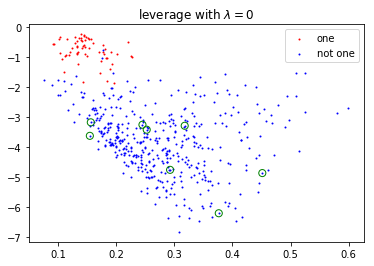


#### Problem 9.24 (Page 48)

(a)由定义即可，将定义中的$N$替换为$N-1$

(b)分别计算$\mathbb E_{\mathcal Z}[N \hat t(\mathcal Z)]$，$\mathbb E_{\mathcal Z}[(N-1) \hat t_n]$
$$
\begin{aligned}
\mathbb E_{\mathcal Z}[N \hat t(\mathcal Z)]
&=N (t + \frac{a_1}{N} +\frac{a_2}{N^2} + O(\frac 1 {N^3})) \\
&=N t + a_1 +\frac{a_2}{N}  +O(\frac 1 {N^2})\\
\end{aligned}\\
\begin{aligned}
\mathbb E_{\mathcal Z}[(N-1) \hat t_n]
&=(N-1) (t + \frac{a_1}{N-1} +\frac{a_2}{(N-1)^2} + O(\frac 1 {N^3})) \\
&=(N-1) t + a_1 +\frac{a_2}{N-1}  +O(\frac 1 {N^2})
\end{aligned}
$$

所以
$$
\begin{aligned}
\mathbb E_{\mathcal Z}[\hat \tau_n]
&=\mathbb E_{\mathcal Z}[N \hat t(\mathcal Z)] - \mathbb E_{\mathcal Z}[(N-1) \hat t_n]\\
&=N t + a_1 +\frac{a_2}{N} -(N-1) t - a_1 -\frac{a_2}{N-1}  +O(\frac 1 {N^2}) \\
&= t -\frac{a_2}{N(N-1)}+O(\frac 1 {N^2}) 
\end{aligned}
$$
(c)计算之前给出如下记号
$$
a_1 =\sum_{m=1}^N x_m,a_2 =\sum_{m=1}^N x_m^2
$$
所以
$$
s^2 =\frac 1 N  a_2 -\frac 1 {N^2 }a_1 ^2
$$
由定义可知
$$
\begin{aligned}
s_n^2 
&=\frac 1 {N-1} \Big(\sum_{m=1}^N x_m^2-x_n^2\Big)-
\frac 1 {(N-1)^2 }\Big(\sum_{m=1}^N x_m -x_n\Big) ^2 \\
&=\frac 1 {N-1} \Big(a_2-x_n^2\Big)-
\frac 1 {(N-1)^2 }\Big(a_1 -x_n\Big) ^2
\end{aligned}
$$
对$\sum_{n=1}^N s_n^2 $进行处理
$$
\begin{aligned}
\sum_{n=1}^N s_n^2 
&= \frac 1 {N-1} \sum_{n=1}^N\Big(a_2-x_n^2\Big)-
\frac 1 {(N-1)^2 }\sum_{n=1}^N\Big(a_1 -x_n\Big) ^2 \\
&=\frac 1 {N-1}(Na_2 -\sum_{n=1}^Nx_n^2) 
-\frac 1 {(N-1)^2 }\Big(Na_1^2 +\sum_{n=1}^N x_n^2-2a_1\sum_{n=1}^N x_n \Big) \\
&=a_2 -\frac 1 {(N-1)^2 }\Big(Na_1^2 + a_2 -2a_1^2  \Big) \\
&= \frac{(N^2 -2N)a_2 -(N-2)a_1^2}{(N-1)^2}\\
&=\frac{(N-2)(Na_2 -a_1^2)}{(N-1)^2}\\
&=\frac{(N-2)N^2 s^2}{(N-1)^2}
\end{aligned}
$$
因此
$$
\begin{aligned}
Ns^2 -\frac{N-1}{N} \sum_{n=1}^N  s_n^2
&=Ns^2-\frac{N-1}{N}\frac{(N-2)N^2 s^2}{(N-1)^2} \\
&=Ns^2-\frac{(N-2)Ns^2}{N-1} \\
&=Ns^2 (1- \frac {N-2}{N-1}) \\
&=\frac{N}{N-1}s^2
\end{aligned}
$$
(d)如果本来是渐近有偏的，那么jackknife estimate并不能改变有偏性

(e)此时相当于$a_1=0$，那么这时要比较以下两项绝对值的大小
$$
\frac{a_2}{N^2} ,-\frac{a_2}{N(N-1)}
$$
不难看出
$$
|\frac{a_2}{N^2}| \le |\frac{a_2}{N(N-1)}|
$$
说明这时候jackknife estimate的偏差更大


#### Problem 9.25 (Page 49)

(a)由之前几章的讨论可知$E_{in}$是对$E_{out}$较小的估计，当模型的方差不大时，可以认为是渐近无偏的

(b)这个两个结论由定义以及上一题即可得到
(c)由定义不难看出
$$
\mathbb E_{\mathcal D} [ E_{in}(g^{\mathcal D_n}) ]=
\epsilon_{\text{out}}(N-1)
+\frac{a_1}{ N-1}+\frac{a_2}{(N-1)^2}+...
$$
注意
$$
\mathbb E_{\mathcal D} [ E_{in}(g^{\mathcal D}) ]=
\epsilon_{\text{out}}(N)
+\frac{a_1}{ N}+\frac{a_2}{N^2}+...
$$
所以
$$
\begin{aligned}
\mathbb E_{\mathcal D} [E_J ] 
&=N\epsilon_{\text{out}}(N)+a_1 +\frac {a_2}{N}- 
(N-1)\epsilon_{\text{out}}(N-1) -a_1 -\frac {a_2}{N-1}
+O(\frac 1 {N^2})\\
&=\epsilon_{\text{out}}(N)+(N-1)(\epsilon_{\text{out}}(N)-\epsilon_{\text{out}}(N-1))
+O(\frac 1 {N^2})
\end{aligned}
$$
(d)将$\epsilon_{\text{out}}(N)= E+\frac{b_1}{N}+\frac{b_2}{N^2}+...$带入上式可得
$$
\begin{aligned}
\mathbb E_{\mathcal D} [E_J ] 
&=\epsilon_{\text{out}}(N)+(N-1)
(E+\frac{b_1}{N}+\frac{b_2}{N^2}-E-\frac{b_1}{N-1}-\frac{b_2}{(N-1)^2})
+O(\frac 1 {N^2})\\
&=\epsilon_{\text{out}}(N) - \frac{b_1}{N}+O(\frac 1 {N^2})
\end{aligned}
$$
